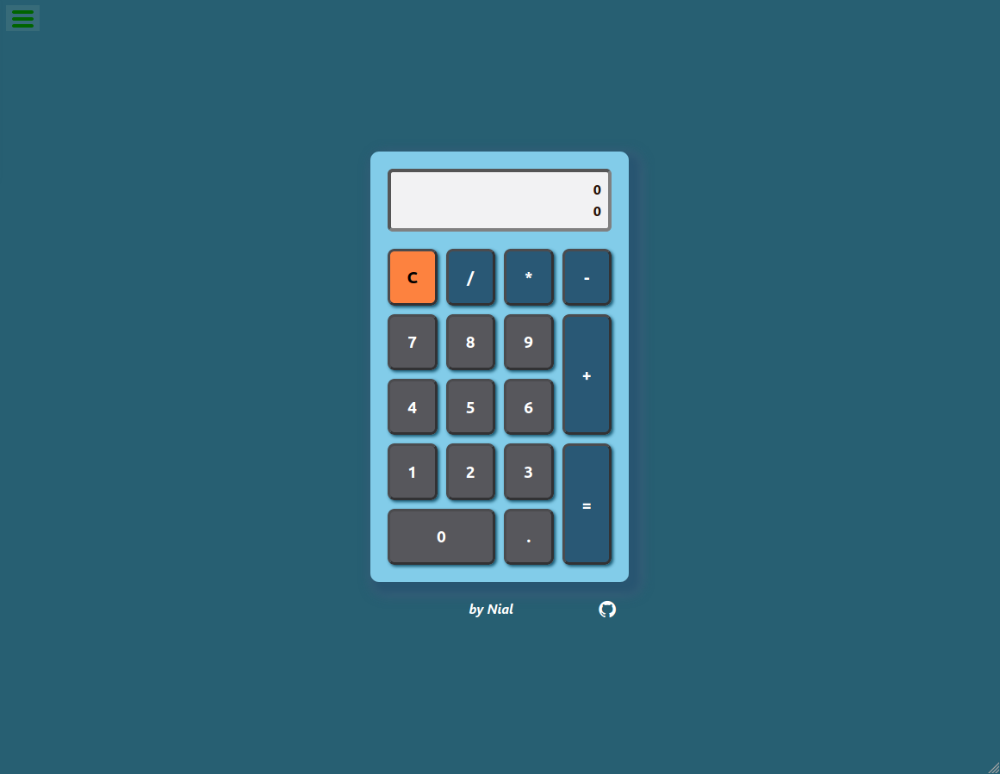

# Calculator
Web base app for performing standard mathematical computations.

## Functions
### Computational functions include:
+ Multiplication
+ Division
+ Subtraction
+ Addition
### Additional function:
+ Clear / Reset

## Display
There is a two level display, one for immediate input and another for the acquired
equation. The acquired equation is located at the of the display screen followed by the
immediate input.

## functionality
+ This Calculator can be operated by the click of Mouse, a Touch pad, the Tab button or a Numeric keypad.
+ Equations containing the following elements can be evaluated:
  + Multiplication
  + Division
  + Addition
  + Subtraction
  + Negative numbers
  + Positive numbers
  + Integer numbers
  + Decimal numbers
+ Integer number cannot begin with a zero.
+ Decimal number cannot begin with multiple zeros before the decimal point.
+ When consecutive computational operators are selected, the last operator is
used (excluding the negative (-) sign).
+ Selecting a computational operator after an equal operator will start a new equation containing the result from the previous equation.
+ Selecting a decimal point after an equal operator will start a new equation containing a decimal starting with a zero (0.).
+ Formula logic is used for this Calculator's logic, where order of operation precedence is observed.

## Implementation
The following languages, framework and libraries were used in the creation:
+ Html5
+ Css3
  + Grid box (for layout and responsiveness)
+ JavaScript ES6
+ React
+ [mathjs](https://mathjs.org/)
+ [create-react-app](https://github.com/facebook/create-react-app)

## Screenshot

## Credit
+ created by [Nial Hope](https://github.com/nhope123)
  + [Portfolio](https://nhope123.github.io/)

## Acknowledgement
Thank you to [Freecodecamp.org](https://www.freecodecamp.org/) for the project idea.

## License
Calculator is an open source software licensed as [GNU General Public License v3.0](LICENSE)
